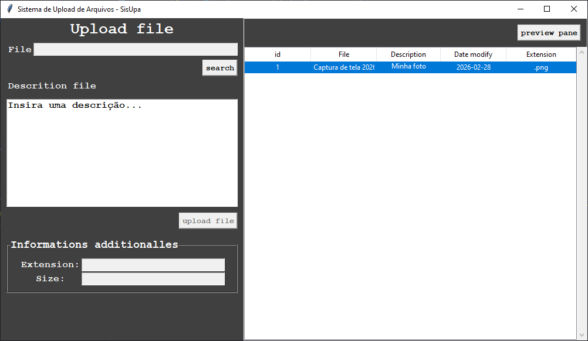
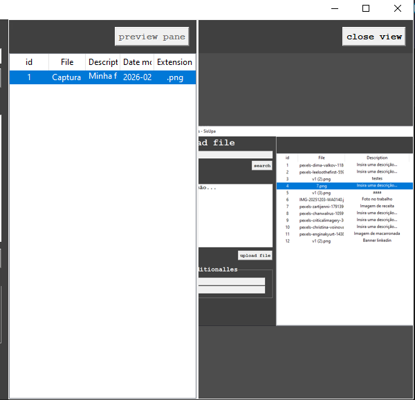

# Sistema de upload de arquivos (SisUpa)

Aplicação desktop desenvolvida com Tkinter para upload, listagem e visualização de arquivos compactados.

Projeto focado em organização arquitetural e aplicação de conceitos de POO.


## Objetivo

Projeto desenvolvido para fins de aprendizado e portfólio profissional, com foco em:

- Separação de responsabilidades
- Estrutura em camadas
- Evolução para aplicação de Design Patterns (Observer, Proxy)

---

## Funcionalidades

- Upload de arquivos
- Persistência de dados
- Listagem dinâmica em Treeview
- Visualização de imagem em painel (PanedWindow)
- Atualização automática da interface após operações

---

## Estrutura

```python
app/
│
├── views/
├── services/
├── repository/
└── main.py
```


- **Views** → Interface gráfica  
- **Services** → Regras de negócio  
- **Repository** → Acesso a dados  
- **App** → Orquestração da aplicação  

---

## Screenshots

### Interface Principal


### Visualização de Arquivo



---

## Execução

```bash
git clone https://github.com/CodePhsp/projeto-tkinter.git
cd projeto-tkinter/app
python main.py